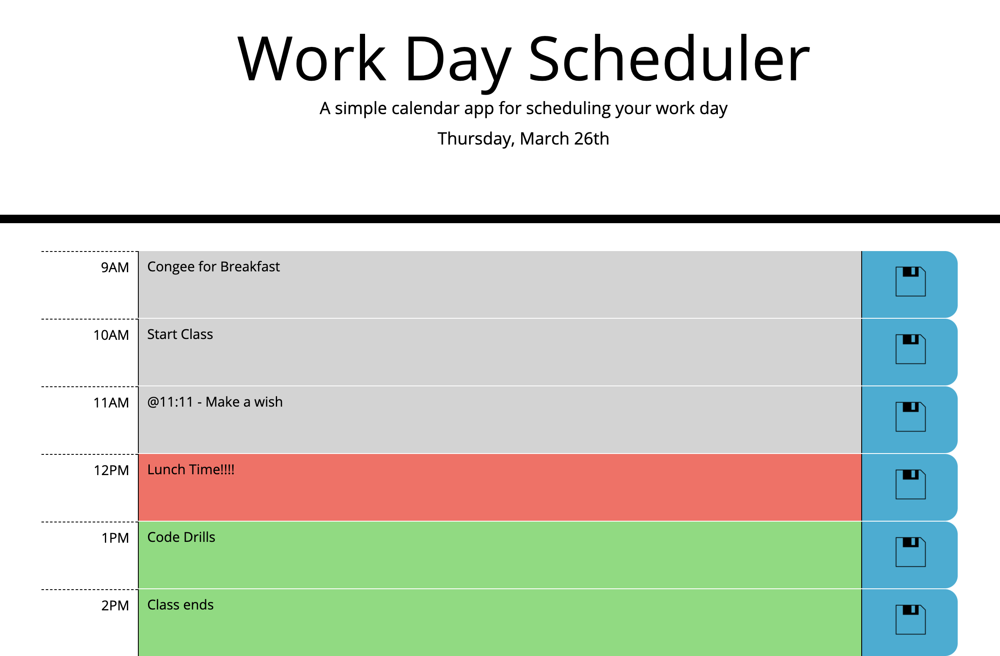

# Day Planner Read Me

## Summary

This website is a simple work day planner application that allows a user to enter events for each hour of the day (9am-5pm). Information added to the planner and saved by the user is stored locally and retrieved when the webpage is reloaded. The page uses Moment.js to retrieve current time and date information so that planner will highligtht current hour in red, previous hours in grey and future hours in green.

## Site Picture



## Technologies Used
- JQuery - used to build a responsive website
- HTML and Bootstrap - used to create elements
- CSS - for styles elements on page
- Git - version control system to track changes to source code
- GitHub - hosts repository that can be deployed in GitHub pages

## Code Snippet

The save activity function is highlighted below because it was an "AHA" moment about how data elements can be used to create references to id's without being forced to give multiple elements the same class value.


```
function saveActivity() {
    // pulls data id value from save button
    var dataID = $(this).data("id");
    // turns value into integer value, matching to desired index
    var index = dataID.split("li")[1];
    // extracts the value of the activity description
    var newDescValue = $("#" + dataID).val();
    // and assigns it back to the planner data
    plannerData[index].activity = newDescValue;
    // this is then stored locally
    localStorage.setItem("pd-AMF", JSON.stringify(plannerData));
    // the rendered HTML is cleared
    $(".container").empty();
    // and the renderPlannerData function is reran
    renderPlannerData();

}
```

## Author Links
- [LinkedIn](https://www.linkedin.com/in/ana-medrano-fernandez/)

- [GitHub](https://github.com/analoo)

## Special Acknoledgements
PNG: Save by Landan Lloyd from the Noun Project
